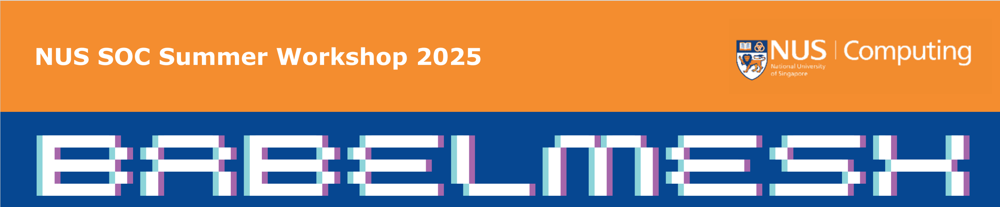

# BabelMesh: A Modern Proxy Service Management Platform

<p align="center">
  
</p>

<p align="center">
  
  
  
  
</p>

<p align="center">
  
  
  
  
  
</p>

---

## 🏆 Award & Recognition

This project was developed during the **NUS School of Computing (SoC) Summer Workshop 2025**, under the **AI, Robots & AIoT Cluster — Cloud Computing Track**, supervised by **Prof. Richard Ma (马天白)** and Teaching Assistant **Tiantong Hu**, PhD candidate under Prof. Ma.

> 🥈 **2nd Place** in the Summer Workshop competition — **Grade: A+**

As **team leader**, I was responsible for the overall system architecture design, backend core implementation, Kubernetes deployment pipeline, and integration of the full-stack system — while coordinating the team's collaborative development workflow throughout the workshop.

---

## 📖 Overview

**BabelMesh** is a modern, production-ready proxy service management platform built on a **Vue3 + Flask** architecture. It provides a sleek web-based control panel for managing SOCKS5 proxy services, featuring real-time traffic monitoring, interactive data visualization, and full cloud-native deployment support on Kubernetes clusters — including AWS EKS.

The name *BabelMesh* reflects the project's core vision: just as the Tower of Babel represented the ambition to bridge all peoples, BabelMesh aspires to seamlessly mesh together heterogeneous networks, devices, and services through a unified, observable proxy layer.

---

## ✨ Key Features

- 🚀 **Modern Web Dashboard** — Responsive management interface built with Vue 3 & Element Plus
- 📊 **Real-Time Traffic Monitoring** — Live byte-level upload/download statistics per connection
- 🔧 **Full SOCKS5 Proxy Engine** — Complete SOCKS5 protocol implementation supporting both domain and IP connections
- 📈 **Interactive Data Visualization** — ECharts-powered live traffic trend graphs
- 📡 **WebSocket Push Architecture** — Socket.IO-based real-time data streaming to the frontend, with 2-second broadcast cycles
- 🐳 **Containerized Deployment** — Docker & Docker Compose support for easy local deployment
- ☸️ **Kubernetes-Native** — Full K8s deployment manifests, tested on both local Minikube and AWS EKS
- 🔄 **Auto-Scaling** — Horizontal Pod Autoscaler (HPA) support for elastic scaling under load
- 💾 **Persistent Configuration** — Stateful configuration storage across restarts

---

## 💡 Innovation Highlights

BabelMesh goes beyond a typical student project in several meaningful ways:

**1. Dual-Protocol Proxy Engine Built from Scratch**
Rather than relying on existing proxy libraries, the SOCKS5 and HTTP proxy engines were implemented from the ground up using raw Python sockets. The `forward_data` method employs `select`-based I/O multiplexing to efficiently handle concurrent bidirectional data streams — a non-trivial engineering decision that avoids the overhead of per-connection threading while maintaining true real-time byte-level observability.

**2. Real-Time Observability at the Byte Level**
Most proxy tools treat traffic as opaque. BabelMesh instruments every forwarded packet, enabling per-connection and aggregate traffic accounting in real time. This data is streamed live to the frontend via WebSocket, making the platform genuinely observable — not just a proxy, but a **proxy with eyes**.

**3. Full-Stack Cloud-Native Design from Day One**
The system was architected to be cloud-native from the ground up, not retrofitted. The modular backend (`proxy_server.py`, `api_routes.py`, `websocket_handler.py`, `config.py`, `app.py`, `utils.py`) maps cleanly onto containerized microservice boundaries, and the Kubernetes deployment was validated on both local Minikube and a live AWS EKS cluster — demonstrating genuine production readiness rather than a toy deployment.

**4. Multi-Environment Branch Strategy**
The repository maintains dedicated branches for distinct deployment targets: `main` for the production-ready full deployment, `demo` for a lightweight showcase build, and a `minikube` branch for local Kubernetes development — reflecting a mature, team-coordinated development workflow.

---

## 🗂 Repository Structure

```
BabelMesh/
├── backend/
│   ├── app.py                   # Application factory and main entrypoint
│   ├── proxy_server.py          # Core SOCKS5/HTTP proxy engine
│   ├── api_routes.py            # REST API route handlers
│   ├── websocket_handler.py     # Socket.IO real-time event handlers
│   ├── config.py                # Multi-environment configuration
│   └── utils.py                 # Utilities: rate limiter, formatter, logger
├── frontend/
│   ├── src/
│   │   ├── components/          # Vue 3 UI components
│   │   └── views/               # Dashboard and management views
│   └── vite.config.js
├── k8s/
│   └── deployment.yaml          # Kubernetes manifests (Deployment, Service, HPA)
├── docs/
│   ├── poster.pdf               # Competition poster
│   ├── slides.pdf               # Presentation slides
│   └── certificate.pdf          # Award certificate
├── docker-compose.yml
├── Dockerfile
└── requirements.txt
```

> **Branches:**
> - `main` — Production-ready full deployment
> - `demo` — Lightweight demo build for showcase
> - `minikube` — Local Kubernetes deployment via Minikube

---

## 🛠 Tech Stack

| Layer | Technologies |
|---|---|
| **Frontend** | Vue 3, Element Plus, ECharts, Socket.IO Client, Vite |
| **Backend** | Flask, Python Socket, Socket.IO (Flask-SocketIO), Gunicorn |
| **Deployment** | Docker, Docker Compose, Kubernetes, AWS EKS |
| **Protocols** | SOCKS5, HTTP/HTTPS Proxy, WebSocket |

---

## 🚀 Quick Start

### Local Development

```bash
# 1. Install backend dependencies
pip install -r requirements.txt

# 2. Install frontend dependencies
cd frontend && npm install

# 3. Start the backend
python app.py

# 4. Start the frontend dev server
cd frontend && npm run dev
```

Access points:
- Web Dashboard: `http://localhost:3000`
- API Endpoint: `http://localhost:5000`
- SOCKS5 Proxy: `localhost:8888`

---

### Docker Deployment

```bash
# Build image
docker build -t babelmesh:latest .

# Launch with Docker Compose
docker-compose up -d
```

Access points:
- Web Dashboard: `http://localhost:5000`
- SOCKS5 Proxy: `localhost:8888`

---

### Kubernetes Deployment

```bash
# Deploy to cluster
kubectl apply -f k8s/deployment.yaml

# Verify deployment
kubectl get pods -n proxy-service
kubectl get svc -n proxy-service
```

For local development with Minikube, see the [`minikube`](../../tree/minikube) branch.

---

## 📡 Backend Architecture

The backend is built around a clean modular design that separates concerns across six dedicated modules:

```
backend/
├── app.py                   # ProxyApp class; create_app factory function
├── proxy_server.py          # ProxyServer: HTTP & SOCKS5 protocol engine
├── api_routes.py            # ProxyAPI: REST endpoint definitions
├── websocket_handler.py     # SocketIOHandler: real-time event & broadcast
├── config.py                # Config: dev/prod/test environment management
└── utils.py                 # Formatters, port checker, rate limiter, logger
```

### Real-Time Traffic Monitoring Core

```python
def forward_data(self, client_sock, remote, connection_id):
    """Byte-level real-time traffic instrumentation."""
    while self.running:
        r, _, _ = select.select([client_sock, remote], [], [], 1.0)
        for s in r:
            data = s.recv(4096)
            if s is client_sock:
                remote.sendall(data)
                self.connections[connection_id]['bytes_sent'] += len(data)
            else:
                client_sock.sendall(data)
                self.connections[connection_id]['bytes_received'] += len(data)
```

---

## 📋 API Reference

| Endpoint | Method | Description |
|---|---|---|
| `/api/proxy/status` | GET | Get current proxy status and statistics |
| `/api/proxy/start` | POST | Start the proxy service |
| `/api/proxy/stop` | POST | Stop the proxy service |
| `/api/proxy/test` | POST | Test proxy connectivity |
| `/api/connections` | GET | List all active connections |
| `/health` | GET | Health check |
| `/ready` | GET | Readiness check |

---

## ⚙️ Configuration

| Variable | Description | Default |
|---|---|---|
| `FLASK_ENV` | Runtime environment (`development` / `production`) | `development` |
| `FLASK_APP` | Application entrypoint | `app.py` |
| Proxy Port | SOCKS5 listening port | `8888` |
| Protocol | Supported proxy protocol | SOCKS5 |

---

## 🔒 Security Considerations

- Non-root user execution inside containers
- Container security context hardening
- CPU and memory resource limits enforced
- Liveness and readiness health checks

---

## 📄 License

This project is licensed under the [MIT License](LICENSE).

---

## 🙏 Acknowledgements

Special thanks to **Prof. Richard Ma (马天白)** for his expert guidance on cloud computing architecture and distributed systems, and to **Tiantong Hu** (TA) for his invaluable technical support throughout the workshop. This project would not have achieved its results without the dedication of every team member.

---

<p align="center">
  Developed with ❤️ at the <strong>NUS School of Computing Summer Workshop 2025</strong><br/>
  Beijing University of Posts and Telecommunications × National University of Singapore
</p>